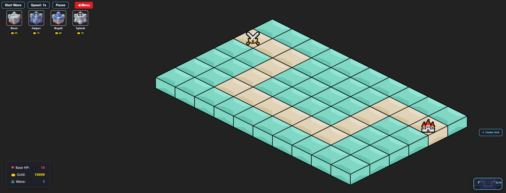

# PixiTD - Tower Defense Game

A browser-based tower defense game built with PixiJS and React. PixiTD features both traditional and procedurally generated levels, multiple tower types, and responsive gameplay.



## Features

- **Multiple Game Modes**
  - Traditional mode with predefined maps
  - Infinity mode with procedurally generated maps
  
- **Tower Types**
  - Basic Tower: Balanced attack and range
  - Sniper Tower: High damage and long range
  - Rapid Tower: Fast firing speed with lower damage
  - Splash Tower: Area damage attack
  
- **Enemy Types**
  - Basic: Standard enemy
  - Fast: Moves quicker but has less health
  - Tank: Slow but high health
  - Boss: Slow with greater health and damage
  
- **Gameplay Features**
  - Upgradeable towers
  - Path preview before waves
  - Dynamic music that changes between build and wave phases
  - Visual and sound effects for combat
  - Tower tooltips and stats
  - Game speed controls and pause functionality
  
- **UI Features**
  - Interactive grid panning with pan/drag controls
  - Touch-friendly controls
  - Minimap path preview
  - Tower drag and drop placement
  - Responsive design for various screen sizes

## Controls

- **Tower Placement**: Drag and drop tower icons to the grid
- **Grid Navigation**: Click and drag the grid to move it around
- **Tower Management**: Click on placed towers to upgrade or sell them
- **Game Controls**: Use the buttons at the top to start waves, adjust speed, or pause the game
- **Return to Menu**: Click the Menu button to return to the main menu

## Technical Implementation

### Isometric Perspective
I chose an isometric view for PixiTD for several reasons:

1. **Depth Perception**: The 3/4 view provides a sense of depth that enhances the game's visual appeal while maintaining a clear view of the playing field.

2. **Strategic Clarity**: Unlike pure top-down views, isometric perspective allows players to see both the height and footprint of game elements, making tower placement decisions more intuitive.

3. **Visual Distinction**: The isometric grid creates natural visual layering, with enemies appearing to walk along a path while towers stand above them, improving gameplay readability.

4. **Implementation Efficiency**: Using PixiJS's container-based rendering, the isometric transformation is handled through mathematical projection rather than requiring complex 3D rendering techniques, keeping the game performant even on lower-end devices.

The isometric projection uses a simple transformation where:
- x_iso = (x - y) * (tileWidth/2)
- y_iso = (x + y) * (tileHeight/4)

This creates the characteristic diamond grid pattern while maintaining accurate hit detection and path visualization.

### Path Algorithm
For the enemy pathfinding, I implemented a weighted Breadth-First Search (BFS) algorithm that:

1. **Prioritizes Direct Routes**: By assigning weights to tiles, the algorithm naturally creates paths that favor direct routes while still respecting obstacles.

2. **Avoids Critical Tiles**: Special handling prevents paths from passing through start/end tiles when inappropriate, creating more realistic and challenging layouts.

3. **Balances Randomness and Playability**: The algorithm introduces controlled randomness to produce varied paths while ensuring they remain practical for gameplay.

4. **Guarantees Valid Paths**: Unlike pure random walks, the BFS-based approach always guarantees a valid, traversable path between waypoints, ensuring every level is actually playable.

This approach creates more engaging gameplay experiences than simple Manhattan distance paths, which would result in overly predictable and easily exploitable routes.

### Procedural Generation in Infinity Mode
Infinity mode utilizes several sophisticated techniques to create endless, unique gameplay:

1. **Edge-Based Start/End Points**: Entry and exit points are strategically placed along different edges of the map, creating natural flow while preventing awkward path configurations.

2. **Progressive Difficulty Scaling**: Enemy stats (health, speed, damage) scale with wave number using non-linear progression formulas that maintain challenge without becoming impossible.

3. **Boss Wave Mechanics**: Every fifth wave introduces special "boss" enemies with significantly enhanced stats and visual indicators, creating natural rhythm and milestone moments.

4. **Adaptive Spawn Rates**: Enemy spawn intervals decrease as waves progress, gradually increasing the pressure on the player's defenses and demanding tower optimization.

The procedural generation ensures no two games play exactly the same, creating virtually unlimited replayability while maintaining balanced, strategic gameplay.


- **Framework**: React with PixiJS rendering
- **Architecture**: Component-based design with custom hooks for game logic
- **Rendering**: Isometric grid with layered sprites
- **Audio**: Dynamic audio management based on game state

## Getting Started

### Prerequisites
- Node.js (version 14 or higher)
- npm or yarn

### Installation
1. Clone the repository
   ```
   git clone https://github.com/daviguerradonascimento/pixitd.git
   cd pixitd
   ```

2. Install dependencies
   ```
   npm install
   ```

3. Start the development server
   ```
   npm start
   ```

4. Build for production
   ```
   npm run build
   ```

## Project Structure

- components: UI components like GameComponent and Tooltip
- entities: Game objects like Tower, Enemy, and Projectile
- managers: Game state management logic
- utils: Helper functions and utility classes
- assets: Game assets (sprites, audio)
- webpack: Webpack configuration files